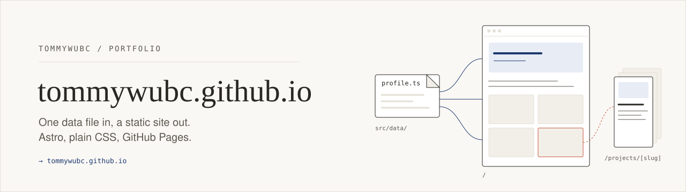
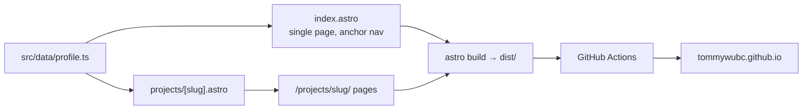

<picture>
  <source media="(prefers-color-scheme: dark)" srcset=".github/assets/banner-dark.svg">
  
</picture>

<p align="center"><b><a href="https://tommywubc.github.io">tommywubc.github.io</a></b> · <a href="https://www.linkedin.com/in/bingchang-wu-017474274/">LinkedIn</a> · <a href="public/resume.pdf">Résumé (PDF)</a></p>

The source for my personal site: Georgia Tech CS student (Intelligence + Systems & Architecture), with projects in RL research, LLM tooling, and full-stack web. If you're here to read about the work rather than the plumbing, **[go to the live site](https://tommywubc.github.io)**. If you want to see how it's built, keep reading.

<p align="center">
  
  <br><sub>The hero banner the home page opens on (<code>public/hero-banner.jpg</code>). An asset, not a full-page screenshot.</sub>
</p>

## how it's built

A small site with a few deliberate constraints.

**All content lives in one file.** Name, bio, projects, experience, education, skills, and links are typed data in [`src/data/profile.ts`](src/data/profile.ts). The `.astro` components only read from it, so updating the site means editing data, not markup.

**Project pages are generated, not written.** [`src/pages/projects/[slug].astro`](src/pages/projects/%5Bslug%5D.astro) maps over the `projects` array in `getStaticPaths()`, so every entry gets its own page at `/projects/<slug>/`. Optional fields (`metrics`, `userStories`, `process`, `video`) only render when present. The GT Movies Store page uses the last three: a process write-up, a demo video, and a list mapping 21 course user stories to the feature that implements each one.

**Static output, no client framework.** `astro.config.mjs` sets `output: 'static'`. The only JavaScript that ships is two small inline scripts: the mobile nav toggle and a scroll-in animation that respects `prefers-reduced-motion` and leaves everything visible if JS never runs.

**Plain CSS with design tokens.** One stylesheet ([`src/styles/global.css`](src/styles/global.css)) with custom properties for the warm paper/ink/navy palette, spacing, and radii. No Tailwind, no CSS-in-JS, no web-font downloads (the font stacks fall back to system fonts).

**Video embeds from a URL.** [`src/utils/video.ts`](src/utils/video.ts) turns a `video.url` into a YouTube, Vimeo, local-file, or generic iframe embed, so adding a demo is a one-line data change.

**Deploys on push.** [`.github/workflows/deploy.yml`](.github/workflows/deploy.yml) runs `npm ci` and `npm run build` on Node 20, then publishes `dist/` with `actions/deploy-pages`.



## editing content

Open `src/data/profile.ts` and change the data:

- **New project:** add an object to `projects`. Its detail page appears at `/projects/<slug>/` on the next build. Put an image in `public/projects/` and set `image: '/projects/<file>'`, or leave it unset for a letter placeholder.
- **Demo video:** set `video.url` to a YouTube/Vimeo link or a file in `public/` (e.g. `/videos/demo.mp4`).
- **Résumé:** replace `public/resume.pdf`, keeping the filename, or point `site.resumeUrl` somewhere else.

The home page currently features GT Movies Store in a separate spotlight section above the project grid. [`src/components/Spotlight.astro`](src/components/Spotlight.astro) explains how to remove it.

## running it locally

Needs Node (CI uses 20).

```bash
npm install
npm run dev       # dev server with hot reload, http://localhost:4321
npm run build     # static site to dist/
npm run preview   # serve the production build locally
```

## deploying

This is a GitHub **user** Pages repo (`TommyWuBC.github.io`), so it's served from the domain root and needs no `base` path.

1. In **Settings → Pages**, set **Source** to **GitHub Actions** (one-time).
2. Push to `main`. The deploy workflow builds and publishes automatically. It can also be run by hand from the **Actions** tab (`workflow_dispatch`).

If this ever moves to a project repo served at `username.github.io/repo-name`, set `base: '/repo-name'` in `astro.config.mjs`.

## repository layout

```
src/
  data/profile.ts            all site content, typed
  pages/index.astro          the single home page (anchor sections)
  pages/projects/[slug].astro  one detail page per project entry
  components/                Header, Hero, Spotlight, About, Projects, Experience, Skills, Contact, Footer
  layouts/BaseLayout.astro   <head>, skip link, scroll-animation script
  styles/global.css          design tokens and base styles
  utils/video.ts             URL → embed resolver
public/
  hero-banner.jpg, profile.jpg, resume.pdf, favicon.svg
  projects/                  project thumbnails
  videos/                    GT Movies Store walkthrough (mp4)
.github/workflows/deploy.yml build + publish to GitHub Pages
```

Stack: [Astro](https://astro.build) 4, TypeScript, plain CSS, GitHub Actions.
