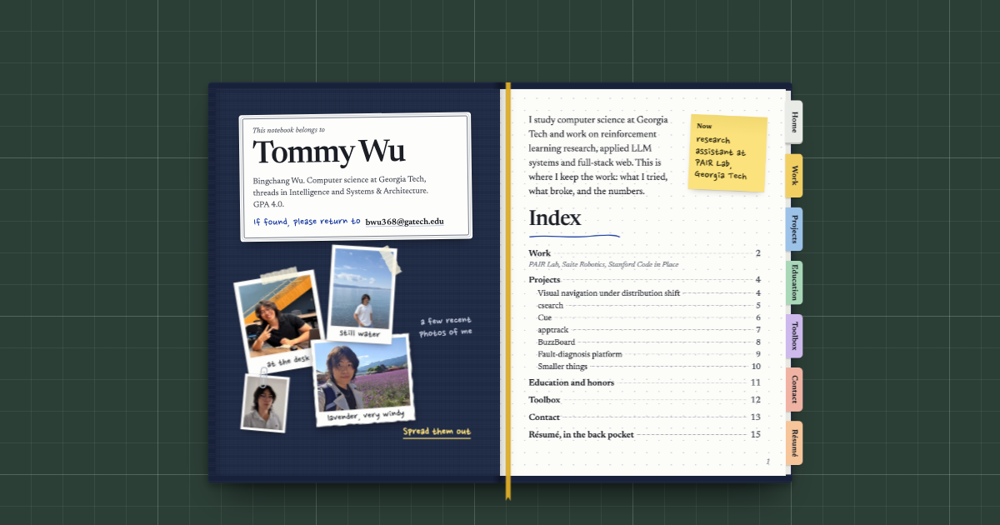

<p align="center"><b><a href="https://tommywubc.github.io">tommywubc.github.io</a></b> · <a href="https://www.linkedin.com/in/bingchang-wu-017474274/">LinkedIn</a> · <a href="public/resume.pdf">Résumé (PDF)</a></p>

The source for my personal site. If you're here for the work, **[go to the site](https://tommywubc.github.io)**.

## How it works

The home page is a **notebook** on a cutting mat. Drag a page corner to turn it, click a tab to riffle to a section, or use the arrow keys. The inside cover has a pile of photos you can drag, flip and spread out. On a phone it becomes a top-bound pocket notebook.

Each project opens into its own interactive write-up, in one of four **shells**:

| Shell | Scene | Used by |
| --- | --- | --- |
| `folder` | a manila folder opened on a desk | Visual navigation (lava race, results chart) |
| `scroll` | a paper roll that unrolls as you read | csearch (live hybrid search), fault diagnosis (log tape to report) |
| `zine` | a two-ink riso booklet you page through | Cue (gaze filter, checkout rules), BuzzBoard (proximity feed, day plan) |
| `map` | an orienteering map with live contours | apptrack (an application as a course) |

`/toolbox/` is a skill map in the same orienteering style: every tool with its logo, and legs to the projects that used it.

There's a lamp (light and dark), a ⌘K menu on every page, and everything reads without JavaScript.

## Adding things

Content lives in files. The schemas in [`src/content.config.ts`](src/content.config.ts) are the contract.

| To add | Do this |
| --- | --- |
| A project | `src/content/projects/<id>.mdx`. It gets a notebook page automatically (the book grows). `tier: archive` makes it one line under "Smaller things" instead. |
| An interactive write-up | Set `expansion: folder \| scroll \| zine \| map` and write the MDX body; it's published at `/work/<id>/` inside that shell. Put the project's interactive components in `src/components/demos/<id>/` and import them from the MDX. |
| A sketch on its notebook page | `src/components/doodles/<id>.astro`, an SVG in `currentColor`. Picked up automatically. |
| A job | `src/content/experience/<id>.md`; the Markdown list becomes the bullets. `projects: [ids]` links it to its projects. |
| About, links, skills | [`src/data/site.ts`](src/data/site.ts). Skills also feed the toolbox map. |

## Layout

```
src/
  pages/index.astro            the notebook (pages generated from content)
  pages/work/[slug].astro      a project inside its shell
  pages/toolbox.astro          the skill map
  layouts/Notebook.astro       desk bar, ⌘K, lamp, toast
  notebook/                    the notebook's CSS and scripts (page turns, photo pile, chrome)
  components/shells/           FolderShell, ScrollShell, ZineShell, MapShell
  components/demos/<id>/       each project's interactive pieces
  components/doodles/<id>.astro
  components/toolbox/          the skill map
  content/                     projects/, experience/, notes/
```

## Running it

Needs Node 22.12 or newer.

```bash
npm install
npm run dev       # http://localhost:4321
npm run check     # type-check
npm run build     # static site in dist/
```

Pushing to `main` type-checks, builds and publishes to GitHub Pages.
